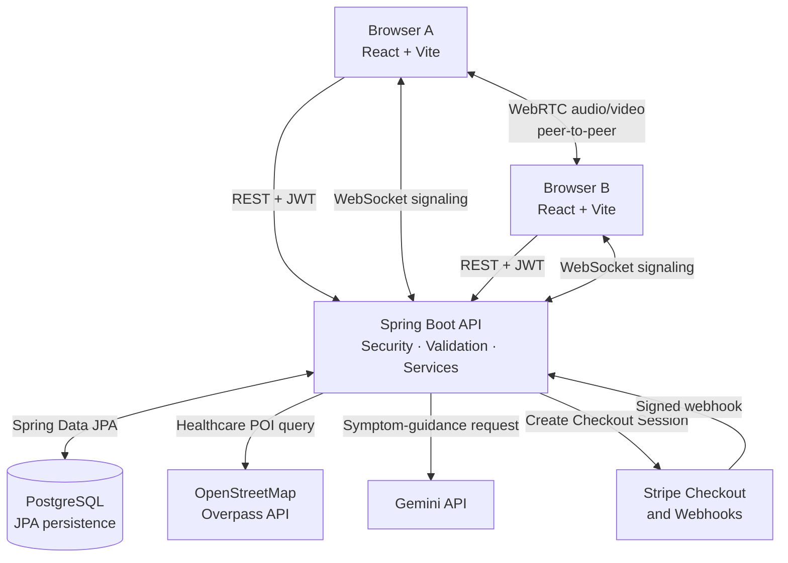
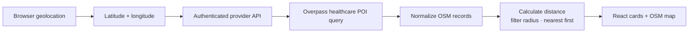
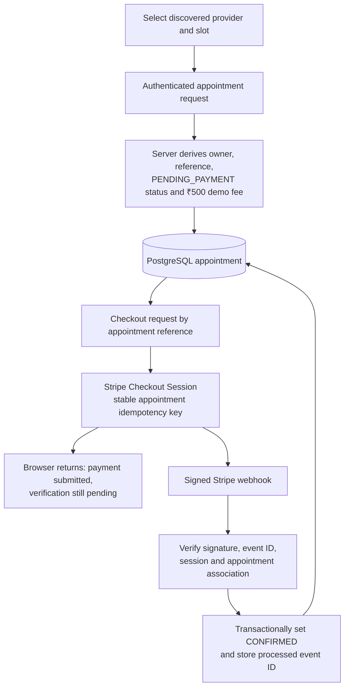
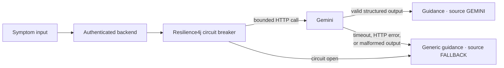
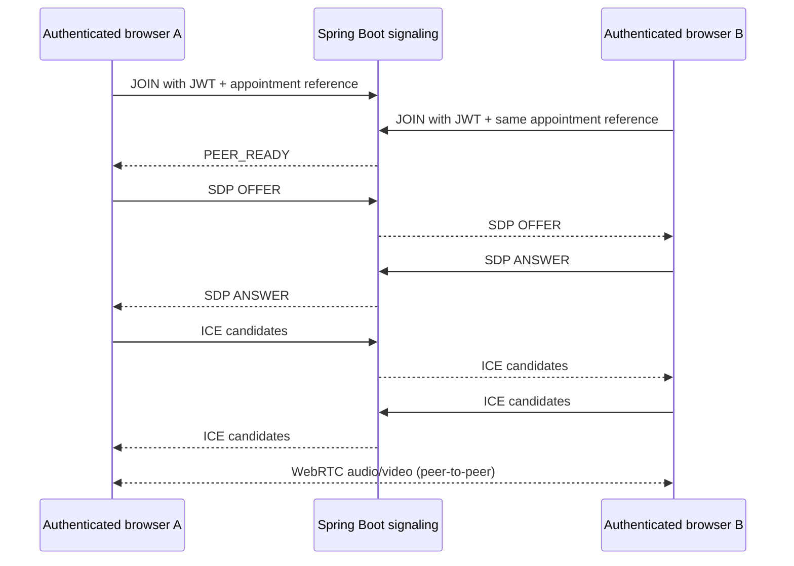

# Saarthi

**A full-stack women's health and teleconsultation demo combining health tracking, nearby provider discovery, AI-assisted symptom guidance, appointment payments, and WebRTC consultation.**

[](https://react.dev/)
[](https://vite.dev/)
[](https://openjdk.org/)
[](https://spring.io/projects/spring-boot)
[](https://www.postgresql.org/)
[](https://stripe.com/)
[](https://webrtc.org/)

Saarthi explores how several healthcare-support workflows can live in one application without presenting AI output as a diagnosis or public map records as verified clinicians. The core backend persists users, appointments, cycle logs, vitals, and processed Stripe events in PostgreSQL. It also integrates OpenStreetMap/Overpass, Gemini, Stripe, and a custom WebSocket signaling server.

The project is intentionally scoped as a technically working student/demo system. Provider participation, production telemedicine operations, and clinical validation are outside its current scope.

**Frontend demo:** [saarthi-nine-gamma.vercel.app](https://saarthi-nine-gamma.vercel.app/)

## Key Features

### Health tracking

- **SheCycle+** supports cycle dates, day logs, reminders, and authenticated backend cycle-log persistence; parts of its richer UI state remain browser-local.
- **MediVault** persists vitals history through authenticated APIs while document metadata remains a browser-local portfolio demonstration.
- Supporting UI modules include a static government-scheme finder, vaccine tracker, NGO directory/inquiry demo, and peer-support UI demo.

### Nearby provider discovery

- Reads browser GPS coordinates and sends them to the authenticated Spring Boot API.
- Queries OpenStreetMap healthcare points of interest through the Overpass API.
- Normalizes node, way, and relation results into a small API DTO, calculates distance on the backend, enforces the requested radius, and sorts nearest first.
- Displays matching provider cards and Leaflet/OpenStreetMap markers from the same OSM records.
- Does not invent ratings, availability, opening hours, or provider-supplied fees.

### Appointments and demo payments

- Creates authenticated appointments in PostgreSQL with server-derived ownership, reference, lifecycle status, and a server-controlled ₹500 Saarthi demo fee.
- Uses a database unique constraint on provider ID, date, and time slot to prevent same-slot double booking.
- Creates Stripe Checkout Sessions from the canonical appointment reference rather than a client-supplied amount.
- Treats a signature-verified Stripe webhook—not the browser redirect—as payment authority and reconciles `PENDING_PAYMENT` to `CONFIRMED`.
- Stores processed Stripe event IDs so duplicate webhook delivery does not repeat the business transition.

### AI-assisted symptom guidance

- Sends authenticated symptom input to a backend-only Gemini client.
- Applies connection/read timeouts and a Resilience4j circuit breaker around the external call.
- Validates the expected response shape and returns an explicitly labelled generic fallback when Gemini is unavailable or malformed.
- Presents educational guidance with a medical disclaimer; it is not a diagnosis or substitute for professional care.

### Video consultation demo

- Uses raw WebSocket messages for SDP offer/answer and ICE-candidate signaling.
- Requires a JWT-authenticated `JOIN`, derives identity on the server, and isolates messages by an owned online appointment reference.
- Limits a room to two authenticated Saarthi sessions and queues early ICE candidates until the remote description is ready.
- Sends audio/video through WebRTC peer-to-peer where the network permits; Spring Boot carries signaling only.

> OSM results are public discovery records, not registered Saarthi doctors. The second WebRTC participant is another authenticated Saarthi session, not a verified clinician account.

## System Architecture



The React SPA uses JWT-protected REST APIs for application data and a raw WebSocket endpoint for WebRTC setup messages. Spring Boot owns authentication, validation, business rules, external-service adapters, and persistence. Media does not pass through the backend.

## How the Core Flows Work

### Provider discovery



The returned providers are OSM records. Saarthi preserves genuine available fields such as name, address, coordinates, contact tags, and OSM URL; missing commercial data is not fabricated.

### Appointment and Stripe lifecycle



The frontend success URL is not proof of payment. The UI refreshes canonical appointment data while the backend waits for trusted webhook evidence.

### Gemini resilience



### WebRTC consultation



Two public Google STUN endpoints help peers discover network addresses. TURN relay infrastructure is not configured, so restrictive NAT/firewall combinations can still prevent media connectivity.

## Engineering Highlights

### Database-enforced booking consistency

An application-only “check then insert” can race when requests arrive together. Saarthi makes PostgreSQL the final correctness boundary with a unique slot constraint over `provider_id + appointment_date + time_slot`; the service translates that specific violation into a clean `409 Conflict`.

### Stripe reconciliation and two forms of idempotency

Checkout creation uses the stable key `appointment-checkout-{appointmentId}` and stores the resulting session ID on the appointment. Separately, webhook consumer idempotency persists each Stripe event ID. Appointment confirmation and event recording share one transaction, preventing a committed confirmation without its duplicate-detection record.

### Bounded AI failure behavior

The Gemini call has a 3-second connection timeout and 10-second read timeout. A count-based circuit breaker opens after the configured failure threshold, avoids repeatedly calling a failing dependency, and routes requests to clearly identified fallback guidance.

### Isolated WebRTC signaling

The server validates the JWT supplied in the first `JOIN`, derives the username rather than trusting a client identity, authorizes the appointment, and prevents a socket from switching rooms. SDP and ICE messages are delivered only to the other session in that appointment-scoped room.

### Consistent API failures

Bean Validation checks request DTOs, while `@RestControllerAdvice` maps known failures to a common response containing timestamp, HTTP status, error, safe message, request path, and optional field errors. SQL details, stack traces, and upstream secrets are not returned.

## Measured Engineering Tests

| Scenario | Deterministic test | Actual result |
|---|---|---|
| Same-slot booking concurrency | `AppointmentConcurrencyIntegrationTest` | 20 simultaneous attempts → 1 success, 19 conflicts, 0 unexpected failures, 1 row for the slot |
| Stripe checkout concurrency | `PaymentServiceIntegrationTest` | 20 attempts → 4 successful responses, 16 conflicts, 4 fake-client create calls, 1 unique idempotency key, 1 logical session, 1 stored session ID |
| Stripe webhook idempotency | `PaymentServiceIntegrationTest` | 20 deliveries of 1 event → 1 confirmation, 19 duplicate acknowledgements, 1 processed-event row, 0 duplicate side effects |
| Gemini circuit breaker | `GeminiResilienceIntegrationTest` | 7 requests → 4 injected upstream failures/invocations, 7 fallback responses, 3 calls short-circuited, final state `OPEN` |
| WebSocket room isolation | `SignalingHandlerIntegrationTest` | 0 messages delivered outside the room; offer, answer, and ICE each had exactly 1 intended recipient |

These are deterministic engineering tests, not production load benchmarks. The booking concurrency test uses H2 in PostgreSQL compatibility mode; it validates the application/constraint behavior but is not a hosted-PostgreSQL performance test.

## Why PostgreSQL

Saarthi's core data is relational: a user owns appointments, cycle logs, and vitals, while payments reference a canonical appointment and processed event. PostgreSQL and JPA provide structured relationships, transactions, unique constraints, and queryable history. Database constraints are especially important here because booking correctness must survive concurrent application requests.

## Tech Stack

| Responsibility | Technology | Use in Saarthi |
|---|---|---|
| Frontend | React 18, Vite 5, Tailwind CSS, Leaflet | SPA, responsive UI, and OSM map rendering |
| Backend | Java 17, Spring Boot 3.1 | REST APIs, validation, business logic, and integrations |
| Security | Spring Security, JWT, BCrypt | Username/password authentication and protected APIs |
| Persistence | PostgreSQL, Spring Data JPA | Users, appointments, cycle logs, vitals, and Stripe event records |
| Provider discovery | OpenStreetMap, Overpass API | Nearby healthcare POI lookup without a paid API key |
| AI resilience | Gemini API, Resilience4j | Educational symptom guidance, circuit breaker, and fallback |
| Payments | Stripe Java SDK | Checkout Sessions, signed webhooks, and reconciliation |
| Real-time | Spring WebSocket, browser WebRTC | Appointment-room signaling and peer-to-peer media |
| Testing/build | JUnit 5, Spring Test/MockMvc, H2, Maven, Vite | Unit/integration tests and reproducible builds |
| Packaging | Docker | Backend/container build configuration |

> Redis appears as a dependency but is not used as an active cache or runtime data store in the current implementation.

## Security and Reliability Boundaries

- Passwords are hashed with BCrypt; successful username/password authentication returns a signed Saarthi JWT.
- Runtime startup requires a configured JWT signing secret instead of silently using a weak default.
- Appointment ownership is derived from the authenticated backend user, and checkout verifies that same ownership.
- Trusted lifecycle fields and the ₹500 demo amount are controlled on the server.
- Response DTOs prevent persistence entities and nested user/password data from becoming accidental API contracts.
- Stripe webhook signatures are verified before reconciliation, and duplicate event IDs are durably recorded.
- Appointment uniqueness is enforced in the database; validation and centralized errors provide safe client responses.
- WebSocket signaling authenticates the first useful message and isolates it by authorized appointment room.
- External OSM and Gemini calls have bounded timeouts; Gemini additionally has a circuit breaker and fallback.

These are implemented safeguards, not a claim of formal security, privacy, or healthcare compliance.

## Project Structure

```text
Saarthi/
├── frontend/
│   ├── src/
│   │   ├── components/       # Feature views and UI flows
│   │   ├── assets/           # Thematic UI imagery
│   │   └── App.jsx           # SPA shell, auth state, and routing-by-tab
│   └── vite.config.js        # Dev server and REST/WebSocket proxies
├── backend/
│   ├── src/main/java/com/saarthi/
│   │   ├── config/           # Security, CORS, and WebSocket setup
│   │   ├── controller/       # REST entry points
│   │   ├── dto/              # Explicit request/response contracts
│   │   ├── exception/        # Central API error mapping
│   │   ├── model/            # JPA entities
│   │   ├── repository/       # Spring Data repositories
│   │   ├── security/         # JWT filter and utilities
│   │   ├── service/          # Business and external-provider logic
│   │   └── websocket/        # Appointment-room signaling handler
│   └── src/test/             # Focused controller/service/integration tests
├── Dockerfile
└── README.md
```

## Local Setup

### Prerequisites

- Java 17+
- Maven 3.8+
- Node.js 18+ and npm
- PostgreSQL

### 1. Create the database

Create a local PostgreSQL database named `saarthidb`, or supply a different JDBC URL through the environment.

```sql
CREATE DATABASE saarthidb;
```

### 2. Configure and run the backend

```bash
cd backend
cp .env.example .env
# Replace placeholders in .env, then export them into the current shell:
set -a
source .env
set +a
mvn spring-boot:run
```

The API starts at `http://localhost:8080` by default. The application currently uses Hibernate `ddl-auto=update`; versioned database migrations are not yet included.

| Environment variable | Required? | Purpose |
|---|---:|---|
| `JWT_SECRET` | Yes | Base64-encoded JWT signing secret |
| `SPRING_DATASOURCE_PASSWORD` | Yes | PostgreSQL password |
| `SPRING_DATASOURCE_URL` | Optional | Overrides `jdbc:postgresql://localhost:5432/saarthidb` |
| `SPRING_DATASOURCE_USERNAME` | Optional | Overrides the default local username |
| `GEMINI_API_KEY` | Optional | Enables live Gemini guidance; otherwise the safe fallback is used |
| `GEMINI_MODEL` | Optional | Overrides the configured Gemini model |
| `STRIPE_API_SECRET_KEY` | Optional | Required for live Stripe Checkout creation |
| `STRIPE_WEBHOOK_SECRET` | Optional | Required to verify live Stripe webhooks |
| `FRONTEND_BASE_URL` | Optional | Stripe success/cancel redirect base URL |
| `OSM_OVERPASS_URL` | Optional | Replaces the default public Overpass endpoint |

Never commit a populated `.env` file or expose backend secrets through Vite variables.

### 3. Run the frontend

```bash
cd frontend
npm install
npm run dev
```

Vite starts at `http://localhost:5173` and proxies `/api` and `/ws` to the local backend. For separate deployments, `VITE_API_BASE_URL` and `VITE_WS_SIGNALING_URL` can override those defaults.

## Testing

```bash
# Backend tests
cd backend
mvn clean test

# Backend package
mvn clean package

# Frontend production build
cd ../frontend
npm run build
```

The final backend suite completed with **57 tests, 0 failures, 0 errors, and 0 skipped tests**. The Maven package and Vite production build also completed successfully.

## Current Scope and Honest Limitations

- OSM providers are discovery records, not verified or registered Saarthi clinician accounts; listed providers do not receive Saarthi bookings or payments.
- Video consultation is a two-authenticated-session demonstration. Real browser-to-browser camera/audio transport still requires deployed manual verification.
- STUN is configured, but TURN is not; calls may fail on restrictive networks.
- Signaling rooms live in one backend instance's memory and are not horizontally distributed.
- `PENDING_PAYMENT` appointments reserve a slot without an expiry/release scheduler.
- JWTs and some supporting-module data are stored in browser `localStorage`; document metadata is not an encrypted medical-record system.
- Gemini output is educational guidance, not medically validated diagnosis, and no real-Gemini reliability benchmark is claimed.

## Future Improvements

- Add verified clinician accounts, roles, availability, and provider-facing appointment workflows.
- Add TURN infrastructure and manually validate media across representative devices and networks.
- Move signaling membership to shared infrastructure if multiple backend instances are introduced.
- Replace `ddl-auto=update` with versioned Flyway or Liquibase migrations.
- Adopt a stronger browser token/session model and persist remaining browser-local modules server-side where appropriate.
- Add reservation expiry, operational monitoring, and rate limiting for public/external-service flows.

## Attribution

Provider and map data © [OpenStreetMap contributors](https://www.openstreetmap.org/copyright). External integrations remain subject to their providers' terms and availability.
